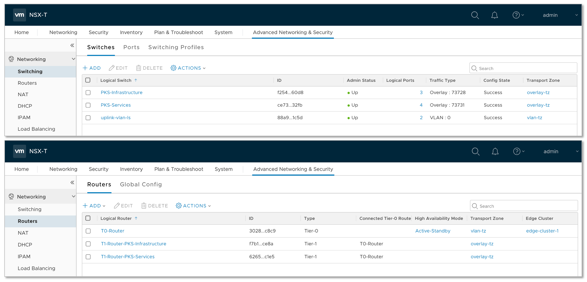
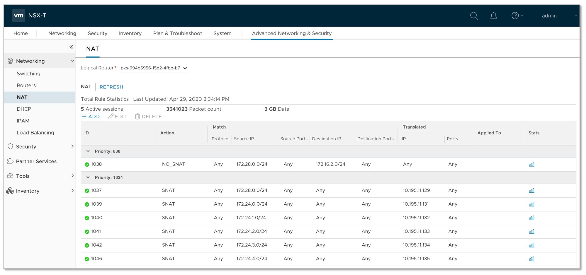
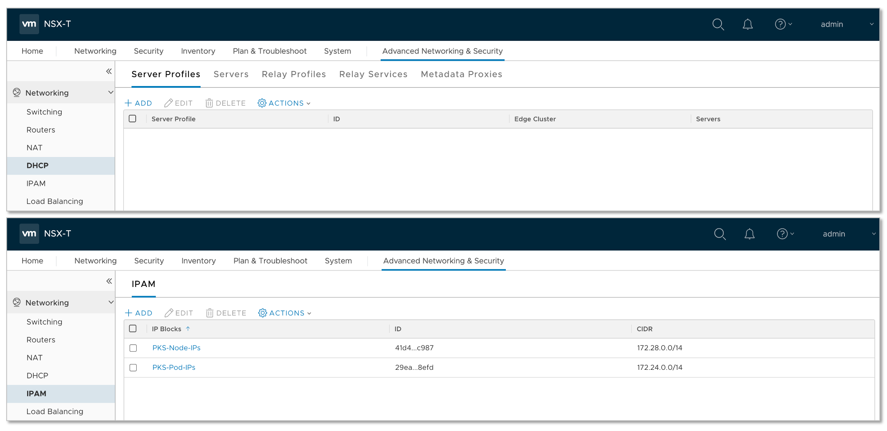
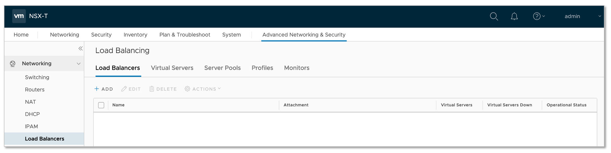
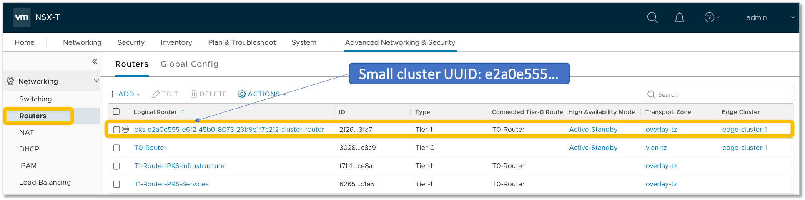
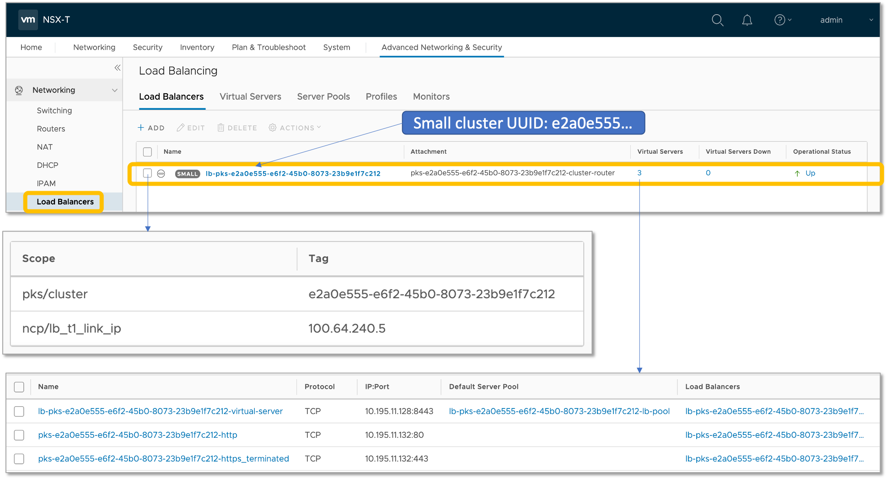
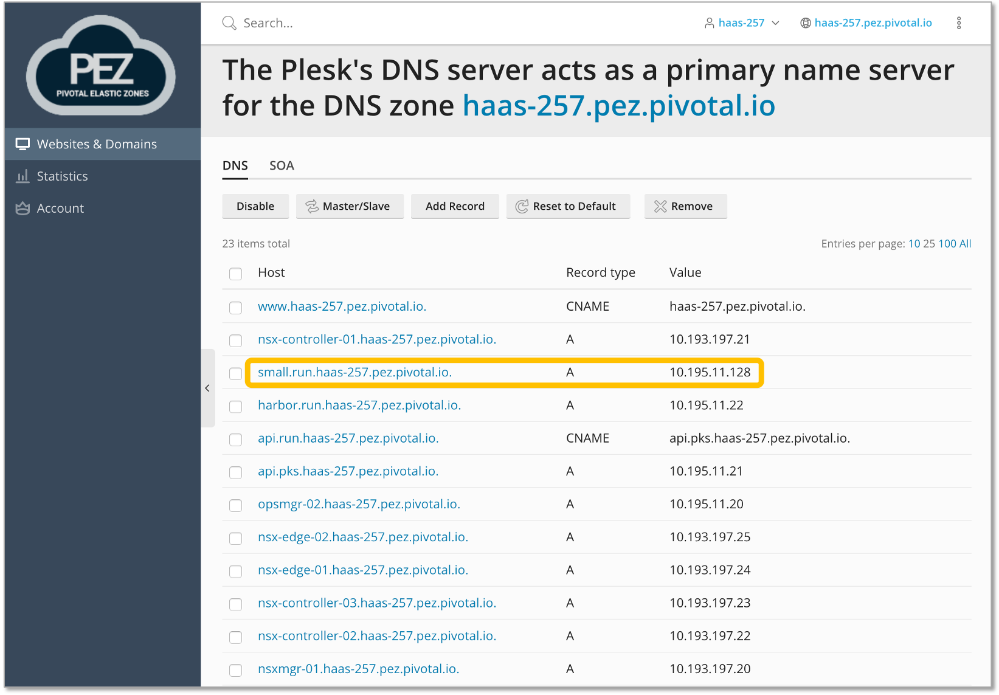
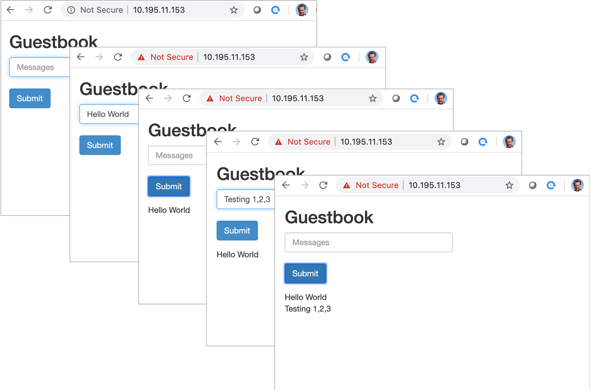

# GuestBook App & Understanding Ingress vs. Load Balancer on vSphere

## Pre-requisites:

- You have access to a TKGI (PKS) environment deployed on vSphere using NSX-T
- The TKGI (PKS) environment has at least one `plan` (which in our example will be the `small` plan)

## Demo Steps

#### 1. First we log into your PKS environment as a `pks_admin` user and create a `small` cluster:

```
$ pks login -a https://api.run.haas-257.pez.pivotal.io -p password -k -u pks_admin
```

- What does NSX-T Manager look like before we create the `small` cluster:






- Let's create the `small` cluster. Note the UUID: `e2a0e555-e6f2-45b0-8073-23b9e1f7c2121`

```
$ pks create-cluster small --plan small --num-nodes 1 -e small.run.haas-257.pez.pivotal.io
```
```python
PKS Version:              1.7.0-build.26
Name:                     small
K8s Version:              1.16.7
Plan Name:                small
UUID:                     e2a0e555-e6f2-45b0-8073-23b9e1f7c212
Last Action:              CREATE
Last Action State:        in progress
Last Action Description:  Creating cluster
Kubernetes Master Host:   small.run.haas-257.pez.pivotal.io
Kubernetes Master Port:   8443
Worker Nodes:             1
Kubernetes Master IP(s):  In Progress
Network Profile Name:     
```
- After about 8 minutes, we have a `small` cluster with a simgle `Master Node` at `10.195.11.128`:

```
$ pks cluster small
```
```python
PKS Version:              1.7.0-build.26
Name:                     small
K8s Version:              1.16.7
Plan Name:                small
UUID:                     e2a0e555-e6f2-45b0-8073-23b9e1f7c212
Last Action:              CREATE
Last Action State:        succeeded
Last Action Description:  Instance provisioning completed
Kubernetes Master Host:   small.run.haas-257.pez.pivotal.io
Kubernetes Master Port:   8443
Worker Nodes:             1
Kubernetes Master IP(s):  10.195.11.128
Network Profile Name:
```
- Let's take a look at what's new in the NSX Manager GUI:




- And before we move on, let's make sure that there's a DNS entry corresponding to `small.run.haas-257.pez.pivotal.io`



- Final check:

```
$ pks get-credentials small
$ kubectl cluster-info
```
```python
Kubernetes master is running at https://small.run.haas-257.pez.pivotal.io:8443
CoreDNS is running at https://small.run.haas-257.pez.pivotal.io:8443/api/v1/namespaces/kube-system/services/kube-dns:dns/proxy
```

#### 2. We clone [this](https://github.com/rm511130/guestbook-ingress-vs-LB-on-vSphere) repo on a MacBook:

```
$ cd /work
$ git clone https://github.com/rm511130/guestbook-ingress-vs-LB-on-vSphere
$ cd guestbook-ingress-vs-LB-on-vSphere
```

#### 3. Let's check whether there is a Storage Class:

```
$ kubectl get sc
$ kubectl apply -f 01-thin-storageclass.yaml
```
```python
storageclass.storage.k8s.io/thin-disk created
```
```
$ kubectl describe sc thin-disk
```
```python
Name:            thin-disk
IsDefaultClass:  Yes
Annotations:     kubectl.kubernetes.io/last-applied-configuration={"apiVersion":"storage.k8s.io/v1","kind":"StorageClass","metadata":{"annotations":{"storageclass.kubernetes.io/is-default-class":"true"},"name":"thin-disk"},"parameters":{"diskformat":"thin"},"provisioner":"kubernetes.io/vsphere-volume"}
,storageclass.kubernetes.io/is-default-class=true
Provisioner:           kubernetes.io/vsphere-volume
Parameters:            diskformat=thin
AllowVolumeExpansion:  <unset>
MountOptions:          <none>
ReclaimPolicy:         Delete
VolumeBindingMode:     Immediate
Events:                <none>
```

#### 4. Create a `GuestBook` Namespace, Persistent Volume Claims for a Redis Master and a Redis Slave:

```
$ kubectl apply -f 02-guestbook-namespace.yaml
```
```
namespace/guestbook created
```
```
$ kubectl apply -f 03-guestbook-redis-master-claim.yaml
```
```
persistentvolumeclaim/redis-master-claim created
```
```
$ kubectl apply -f 04-guestbook-redis-slave-claim.yaml
```
```
persistentvolumeclaim/redis-slave-claim created
```
```
$ kubectl get pvc -n guestbook 
```
```python
NAME                 STATUS   VOLUME                                     CAPACITY   ACCESS MODES   STORAGECLASS   AGE
redis-master-claim   Bound    pvc-adff9d84-89a6-4e2c-a00c-a124ec248ac7   2Gi        RWO            thin-disk      28s
redis-slave-claim    Bound    pvc-56dcd1f2-f6b3-480a-9fa0-22febcd01c18   2Gi        RWO            thin-disk      7s
```

#### 5. Let's Create the GuestBook App

```
$ kubectl apply -f 05-guestbook-app-base.yaml 
```
```python
deployment.apps/redis-master created
service/redis-master created
deployment.apps/redis-slave created
service/redis-slave created
deployment.apps/frontend created
```

#### 6. So what do we have up and running so far?

```
$ kubectl get all -n guestbook
```

- The results shown below indicate that we have a Redis Master exposed as a service, a Redis Slave exposed as a service, 3 Front-end pods, plus a few deployments and replicasets.

```python
NAME                               READY   STATUS    RESTARTS   AGE
pod/frontend-6cb7f8bd65-fmcpg      1/1     Running   0          3m30s
pod/frontend-6cb7f8bd65-hthqx      1/1     Running   0          3m30s
pod/frontend-6cb7f8bd65-wlpfg      1/1     Running   0          3m30s
pod/redis-master-8bfb75f8d-9tvks   1/1     Running   0          3m32s
pod/redis-slave-779b6d8f79-mfx84   1/1     Running   0          3m31s


NAME                   TYPE        CLUSTER-IP       EXTERNAL-IP   PORT(S)    AGE
service/redis-master   ClusterIP   10.100.200.193   <none>        6379/TCP   3m31s
service/redis-slave    ClusterIP   10.100.200.81    <none>        6379/TCP   3m31s


NAME                           READY   UP-TO-DATE   AVAILABLE   AGE
deployment.apps/frontend       3/3     3            3           3m30s
deployment.apps/redis-master   1/1     1            1           3m32s
deployment.apps/redis-slave    1/1     1            1           3m31s

NAME                                     DESIRED   CURRENT   READY   AGE
replicaset.apps/frontend-6cb7f8bd65      3         3         3       3m31s
replicaset.apps/redis-master-8bfb75f8d   1         1         1       3m33s
replicaset.apps/redis-slave-779b6d8f79   1         1         1       3m32s
```

#### 7. In order to use the front-end App, let's  expose it using a LoadBalancer service type:

```
$ kubectl apply -f 06-guestbook-frontend-svc-lb.yaml 
```
```python
service/frontend created
```
```
$ kubectl get service -n guestbook 
```
```python
NAME           TYPE           CLUSTER-IP       EXTERNAL-IP     PORT(S)        AGE
frontend       LoadBalancer   10.100.200.178   10.195.11.153   80:31542/TCP   12s
redis-master   ClusterIP      10.100.200.193   <none>          6379/TCP       11m
redis-slave    ClusterIP      10.100.200.81    <none>          6379/TCP       11m
```


#### 8. Let's take a look at what happened on the NSX-T end:

- The following command tells us that the UUID of the `small` cluster is `994b...`.

```
pks cluster small
```
```python
PKS Version:              1.7.0-build.26
Name:                     small
K8s Version:              1.16.7
Plan Name:                small
UUID:                     994b5956-15d2-4fbb-b791-a5624e3347bb
Last Action:              CREATE
Last Action State:        succeeded
Last Action Description:  Instance provisioning completed
Kubernetes Master Host:   small.run.haas-257.pez.pivotal.io
Kubernetes Master Port:   8443
Worker Nodes:             1
Kubernetes Master IP(s):  10.195.11.128
Network Profile Name:
```
- 


# Guestbook Kubernetes Deployment

This manifest provides a simple deployment of the Guestbook application for testing and validtion of your Kubernetes install.  It uses individual YAML files to deploy the namespace, storageclass, persistent volume claims and application components.  You then have an option to expose the Frontend application services using ingress or service type loadbalancer.  

Choose only one option to expose the Frontend service (i.e either guestbook-frontend-http-ingress.yaml, guestbook-frontend-https-ingress.yaml (requires you create guestbook-secret of time) or guestbook-frontend-svc-lb.yaml)
